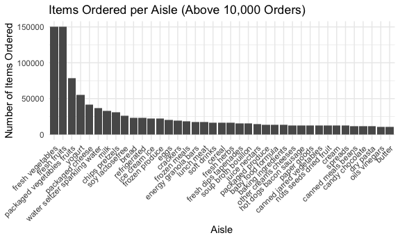
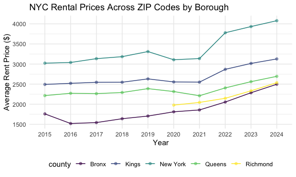
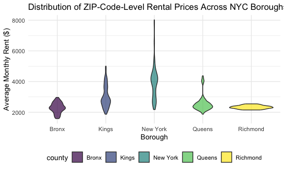
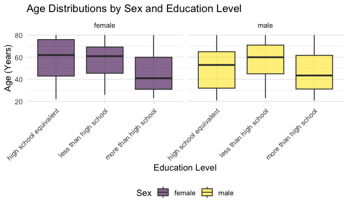
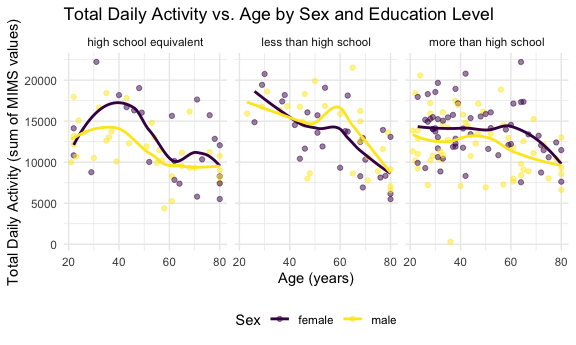
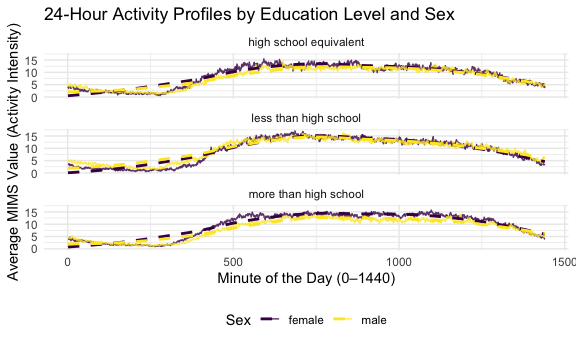

    #Import data and copy and paste setting options from class.
    library(tidyverse)

    ## ── Attaching core tidyverse packages ──────────────────────────────────────────────────────────────────────────── tidyverse 2.0.0 ──
    ## ✔ dplyr     1.1.4     ✔ readr     2.1.5
    ## ✔ forcats   1.0.0     ✔ stringr   1.5.1
    ## ✔ ggplot2   3.5.2     ✔ tibble    3.3.0
    ## ✔ lubridate 1.9.4     ✔ tidyr     1.3.1
    ## ✔ purrr     1.1.0     
    ## ── Conflicts ────────────────────────────────────────────────────────────────────────────────────────────── tidyverse_conflicts() ──
    ## ✖ dplyr::filter() masks stats::filter()
    ## ✖ dplyr::lag()    masks stats::lag()
    ## ℹ Use the conflicted package (<http://conflicted.r-lib.org/>) to force all conflicts to become errors

    library(patchwork)

    knitr::opts_chunk$set(
      fig.width = 6,
      fig.asp = .6,
      out.width = "90%"
    )

    theme_set(theme_minimal() + theme(legend.position = "bottom"))

    options(
      ggplot2.continuous.colour = "viridis",
      ggplot2.continuous.fill = "viridis"
    )

    scale_colour_discrete = scale_colour_viridis_d
    scale_fill_discrete = scale_fill_viridis_d

## Problem 1

    library(p8105.datasets)
    data("instacart")
    instacart

    ## # A tibble: 1,384,617 × 15
    ##    order_id product_id add_to_cart_order reordered user_id eval_set order_number order_dow order_hour_of_day days_since_prior_order
    ##       <int>      <int>             <int>     <int>   <int> <chr>           <int>     <int>             <int>                  <int>
    ##  1        1      49302                 1         1  112108 train               4         4                10                      9
    ##  2        1      11109                 2         1  112108 train               4         4                10                      9
    ##  3        1      10246                 3         0  112108 train               4         4                10                      9
    ##  4        1      49683                 4         0  112108 train               4         4                10                      9
    ##  5        1      43633                 5         1  112108 train               4         4                10                      9
    ##  6        1      13176                 6         0  112108 train               4         4                10                      9
    ##  7        1      47209                 7         0  112108 train               4         4                10                      9
    ##  8        1      22035                 8         1  112108 train               4         4                10                      9
    ##  9       36      39612                 1         0   79431 train              23         6                18                     30
    ## 10       36      19660                 2         1   79431 train              23         6                18                     30
    ## # ℹ 1,384,607 more rows
    ## # ℹ 5 more variables: product_name <chr>, aisle_id <int>, department_id <int>, aisle <chr>, department <chr>

The dataset contains 1,384,617 observations of 131,209 unique users,
where each row in the dataset is a product from an order. There is a
single order per user in this dataset. There are 15 variables in this
dataset, and a couple key important variables are product\_name: the
name of the product, order\_hour\_of\_day: what time of day the product
was ordered, order\_dow: what day of the week the product was ordered,
aisle: which aisle the product was ordered from, and department: which
department the product falls under.

    n_aisles = instacart |> 
      summarize(n_aisles = n_distinct(aisle)) |> 
      pull(n_aisles)

    n_aisles

    ## [1] 134

    #Counting the number of items ordered per aisle and rearranging from descending order to get the aisle with the most orders on top. 
    intacart_items_ordered = instacart |> 
      count(aisle, name = "items_ordered") |> 
      arrange(desc(items_ordered))

    intacart_items_ordered

    ## # A tibble: 134 × 2
    ##    aisle                         items_ordered
    ##    <chr>                                 <int>
    ##  1 fresh vegetables                     150609
    ##  2 fresh fruits                         150473
    ##  3 packaged vegetables fruits            78493
    ##  4 yogurt                                55240
    ##  5 packaged cheese                       41699
    ##  6 water seltzer sparkling water         36617
    ##  7 milk                                  32644
    ##  8 chips pretzels                        31269
    ##  9 soy lactosefree                       26240
    ## 10 bread                                 23635
    ## # ℹ 124 more rows

There are 134 aisles and most items are ordered from the fresh
vegetables and fresh fruits sections.

    #Making a bar chart. Showing the aisle name at the bottom with how many items were ordered on the y axis. Showing the most ordered from aisles on the left and going in decreasing order. 

    intacart_items_ordered  |> 
      filter(items_ordered > 10000) |> 
      ggplot(aes(x = reorder(aisle, -items_ordered), y = items_ordered)) + 
      geom_col() +
      theme(axis.text.x = element_text(angle = 45, hjust = 1)) +  # rotate labels
      labs(title = "Items Ordered per Aisle (Above 10,000 Orders)",
           x = "Aisle",
           y = "Number of Items Ordered")

    intacart_items_ordered

    ## # A tibble: 134 × 2
    ##    aisle                         items_ordered
    ##    <chr>                                 <int>
    ##  1 fresh vegetables                     150609
    ##  2 fresh fruits                         150473
    ##  3 packaged vegetables fruits            78493
    ##  4 yogurt                                55240
    ##  5 packaged cheese                       41699
    ##  6 water seltzer sparkling water         36617
    ##  7 milk                                  32644
    ##  8 chips pretzels                        31269
    ##  9 soy lactosefree                       26240
    ## 10 bread                                 23635
    ## # ℹ 124 more rows

From this histogram, we can see that Fresh fruits, fresh vegetable, and
packaged vegetable fruits were ordered the most. Candy chocolate, dry
pasta, oils vinegars, and butter were ordered the least.

    #Filtering by the aisles we want, selecting by the product name, and summarizing by the number of orderes for each aisle and product name grouped. Filtering the top 3 rows for each aisle.

    top_3_items = instacart |> 
      filter(aisle == c("baking ingredients", "dog food care", "packaged vegetables fruits")) |> 
      select(aisle, product_name) |> 
      group_by(aisle, product_name) |> 
      summarize(n_orders = n()) |> 
      arrange(aisle, desc(n_orders)) |> 
      filter(row_number() <= 3) 

    ## `summarise()` has grouped output by 'aisle'. You can override using the `.groups` argument.

    top_3_items

    ## # A tibble: 9 × 3
    ## # Groups:   aisle [3]
    ##   aisle                      product_name                                    n_orders
    ##   <chr>                      <chr>                                              <int>
    ## 1 baking ingredients         Light Brown Sugar                                    157
    ## 2 baking ingredients         Pure Baking Soda                                     140
    ## 3 baking ingredients         Organic Vanilla Extract                              122
    ## 4 dog food care              Organix Grain Free Chicken & Vegetable Dog Food       14
    ## 5 dog food care              Organix Chicken & Brown Rice Recipe                   13
    ## 6 dog food care              Original Dry Dog                                       9
    ## 7 packaged vegetables fruits Organic Baby Spinach                                3324
    ## 8 packaged vegetables fruits Organic Raspberries                                 1920
    ## 9 packaged vegetables fruits Organic Blueberries                                 1692

    knitr::kable(top_3_items)

<table style="width:100%;">
<colgroup>
<col style="width: 32%" />
<col style="width: 57%" />
<col style="width: 10%" />
</colgroup>
<thead>
<tr>
<th style="text-align: left;">aisle</th>
<th style="text-align: left;">product_name</th>
<th style="text-align: right;">n_orders</th>
</tr>
</thead>
<tbody>
<tr>
<td style="text-align: left;">baking ingredients</td>
<td style="text-align: left;">Light Brown Sugar</td>
<td style="text-align: right;">157</td>
</tr>
<tr>
<td style="text-align: left;">baking ingredients</td>
<td style="text-align: left;">Pure Baking Soda</td>
<td style="text-align: right;">140</td>
</tr>
<tr>
<td style="text-align: left;">baking ingredients</td>
<td style="text-align: left;">Organic Vanilla Extract</td>
<td style="text-align: right;">122</td>
</tr>
<tr>
<td style="text-align: left;">dog food care</td>
<td style="text-align: left;">Organix Grain Free Chicken &amp; Vegetable
Dog Food</td>
<td style="text-align: right;">14</td>
</tr>
<tr>
<td style="text-align: left;">dog food care</td>
<td style="text-align: left;">Organix Chicken &amp; Brown Rice
Recipe</td>
<td style="text-align: right;">13</td>
</tr>
<tr>
<td style="text-align: left;">dog food care</td>
<td style="text-align: left;">Original Dry Dog</td>
<td style="text-align: right;">9</td>
</tr>
<tr>
<td style="text-align: left;">packaged vegetables fruits</td>
<td style="text-align: left;">Organic Baby Spinach</td>
<td style="text-align: right;">3324</td>
</tr>
<tr>
<td style="text-align: left;">packaged vegetables fruits</td>
<td style="text-align: left;">Organic Raspberries</td>
<td style="text-align: right;">1920</td>
</tr>
<tr>
<td style="text-align: left;">packaged vegetables fruits</td>
<td style="text-align: left;">Organic Blueberries</td>
<td style="text-align: right;">1692</td>
</tr>
</tbody>
</table>

Light brown sugar, organix grain free chichen and vegetable dog food,
and organic baby spinach were the products bought the most between
baking ingredients, dog food care, and packaged vegetable fruits.

    # Filter two specific products. Computes average order time per weekday. Converts day numbers to names. Displays the results in a clear, comparative table.
    mean_hour = instacart |> 
      filter(product_name == c("Pink Lady Apples", "Coffee Ice Cream")) |> 
      select(product_name, order_hour_of_day, order_dow) |> 
      group_by(product_name, order_dow) |> 
      summarize(mean_hour = round(mean(order_hour_of_day), 2)) |> 
        mutate(
        order_dow = as.integer(order_dow),
        order_dow = case_when(
          order_dow == 0 ~ "Sunday",
          order_dow == 1 ~ "Monday",
          order_dow == 2 ~ "Tuesday",
          order_dow == 3 ~ "Wednesday",
          order_dow == 4 ~ "Thursday",
          order_dow == 5 ~ "Friday",
          order_dow == 6 ~ "Saturday"
        )) |> 
      pivot_wider (
        names_from = "order_dow",
        values_from = "mean_hour"
      ) 

    ## Warning: There was 1 warning in `filter()`.
    ## ℹ In argument: `product_name == c("Pink Lady Apples", "Coffee Ice Cream")`.
    ## Caused by warning in `product_name == c("Pink Lady Apples", "Coffee Ice Cream")`:
    ## ! longer object length is not a multiple of shorter object length

    ## `summarise()` has grouped output by 'product_name'. You can override using the `.groups` argument.

    mean_hour

    ## # A tibble: 2 × 8
    ## # Groups:   product_name [2]
    ##   product_name     Sunday Monday Tuesday Wednesday Thursday Friday Saturday
    ##   <chr>             <dbl>  <dbl>   <dbl>     <dbl>    <dbl>  <dbl>    <dbl>
    ## 1 Coffee Ice Cream   13.2   15      15.3      15.4     15.2   10.3     12.4
    ## 2 Pink Lady Apples   12.2   11.7    12        13.9     11.9   13.9     11.6

    knitr::kable(mean_hour)

<table style="width:100%;">
<colgroup>
<col style="width: 22%" />
<col style="width: 9%" />
<col style="width: 9%" />
<col style="width: 10%" />
<col style="width: 13%" />
<col style="width: 12%" />
<col style="width: 9%" />
<col style="width: 12%" />
</colgroup>
<thead>
<tr>
<th style="text-align: left;">product_name</th>
<th style="text-align: right;">Sunday</th>
<th style="text-align: right;">Monday</th>
<th style="text-align: right;">Tuesday</th>
<th style="text-align: right;">Wednesday</th>
<th style="text-align: right;">Thursday</th>
<th style="text-align: right;">Friday</th>
<th style="text-align: right;">Saturday</th>
</tr>
</thead>
<tbody>
<tr>
<td style="text-align: left;">Coffee Ice Cream</td>
<td style="text-align: right;">13.22</td>
<td style="text-align: right;">15.00</td>
<td style="text-align: right;">15.33</td>
<td style="text-align: right;">15.40</td>
<td style="text-align: right;">15.17</td>
<td style="text-align: right;">10.33</td>
<td style="text-align: right;">12.35</td>
</tr>
<tr>
<td style="text-align: left;">Pink Lady Apples</td>
<td style="text-align: right;">12.25</td>
<td style="text-align: right;">11.68</td>
<td style="text-align: right;">12.00</td>
<td style="text-align: right;">13.94</td>
<td style="text-align: right;">11.91</td>
<td style="text-align: right;">13.87</td>
<td style="text-align: right;">11.56</td>
</tr>
</tbody>
</table>

Coffee Ice Cream is typically ordered in the afternoon on weekdays
(around 3 PM), but earlier on Friday and the weekend (around 10–12
PM).This suggests that people might buy ice cream earlier when they have
more free time (like weekend shopping). Pink Lady Apples are generally
ordered around midday, with small variations across the week. People
might be adding fruit to their groceries during regular shopping times —
more consistent and practical compared to the more treat-based purchase
pattern of ice cream.

## Question 2

    #Import and clean zipcodes dataset. Remove irrelevant columns, such as state_fips and file_date. 
    zipcodes = 
     read_csv("zillow_data/Zip Codes.csv", na = c("NA",".", "")) |> 
      janitor :: clean_names() |> 
      select(-"state_fips", -"file_date")  

    ## Rows: 322 Columns: 7
    ## ── Column specification ────────────────────────────────────────────────────────────────────────────────────────────────────────────
    ## Delimiter: ","
    ## chr (4): County, County Code, File Date, Neighborhood
    ## dbl (3): State FIPS, County FIPS, ZipCode
    ## 
    ## ℹ Use `spec()` to retrieve the full column specification for this data.
    ## ℹ Specify the column types or set `show_col_types = FALSE` to quiet this message.

    zipcodes

    ## # A tibble: 322 × 5
    ##    county county_code county_fips zip_code neighborhood              
    ##    <chr>  <chr>             <dbl>    <dbl> <chr>                     
    ##  1 Bronx  005               36005    10451 High Bridge and Morrisania
    ##  2 Bronx  005               36005    10452 High Bridge and Morrisania
    ##  3 Bronx  005               36005    10453 Central Bronx             
    ##  4 Bronx  005               36005    10454 Hunts Point and Mott Haven
    ##  5 Bronx  005               36005    10455 Hunts Point and Mott Haven
    ##  6 Bronx  005               36005    10456 High Bridge and Morrisania
    ##  7 Bronx  005               36005    10457 Central Bronx             
    ##  8 Bronx  005               36005    10458 Bronx Park and Fordham    
    ##  9 Bronx  005               36005    10459 Hunts Point and Mott Haven
    ## 10 Bronx  005               36005    10460 Central Bronx             
    ## # ℹ 312 more rows

    #Import zillow dataset and analyze what needs to be changed.
    zillow = 
     read_csv("zillow_data/Zip_zori_uc_sfrcondomfr_sm_month_NYC.csv", na = c("NA",".", "")) |> 
      janitor:: clean_names() 

    ## Rows: 149 Columns: 125
    ## ── Column specification ────────────────────────────────────────────────────────────────────────────────────────────────────────────
    ## Delimiter: ","
    ## chr   (6): RegionType, StateName, State, City, Metro, CountyName
    ## dbl (119): RegionID, SizeRank, RegionName, 2015-01-31, 2015-02-28, 2015-03-31, 2015-04-30, 2015-05-31, 2015-06-30, 2015-07-31, 2...
    ## 
    ## ℹ Use `spec()` to retrieve the full column specification for this data.
    ## ℹ Specify the column types or set `show_col_types = FALSE` to quiet this message.

    zillow

    ## # A tibble: 149 × 125
    ##    region_id size_rank region_name region_type state_name state city     metro       county_name x2015_01_31 x2015_02_28 x2015_03_31
    ##        <dbl>     <dbl>       <dbl> <chr>       <chr>      <chr> <chr>    <chr>       <chr>             <dbl>       <dbl>       <dbl>
    ##  1     62080         4       11368 zip         NY         NY    New York New York-N… Queens Cou…         NA          NA          NA 
    ##  2     62093         7       11385 zip         NY         NY    New York New York-N… Queens Cou…         NA          NA          NA 
    ##  3     62019         9       11208 zip         NY         NY    New York New York-N… Kings Coun…         NA          NA          NA 
    ##  4     62046        16       11236 zip         NY         NY    New York New York-N… Kings Coun…         NA          NA          NA 
    ##  5     61807        17       10467 zip         NY         NY    New York New York-N… Bronx Coun…         NA          NA          NA 
    ##  6     62085        18       11373 zip         NY         NY    New York New York-N… Queens Cou…         NA          NA          NA 
    ##  7     62037        19       11226 zip         NY         NY    New York New York-N… Kings Coun…       1920.       1947.       2039.
    ##  8     62018        20       11207 zip         NY         NY    New York New York-N… Kings Coun…       1943.       1851.       1852.
    ##  9     61639        29       10025 zip         NY         NY    New York New York-N… New York C…       3055.       3053.       3050.
    ## 10     62025        32       11214 zip         NY         NY    New York New York-N… Kings Coun…         NA          NA          NA 
    ## # ℹ 139 more rows
    ## # ℹ 113 more variables: x2015_04_30 <dbl>, x2015_05_31 <dbl>, x2015_06_30 <dbl>, x2015_07_31 <dbl>, x2015_08_31 <dbl>,
    ## #   x2015_09_30 <dbl>, x2015_10_31 <dbl>, x2015_11_30 <dbl>, x2015_12_31 <dbl>, x2016_01_31 <dbl>, x2016_02_29 <dbl>,
    ## #   x2016_03_31 <dbl>, x2016_04_30 <dbl>, x2016_05_31 <dbl>, x2016_06_30 <dbl>, x2016_07_31 <dbl>, x2016_08_31 <dbl>,
    ## #   x2016_09_30 <dbl>, x2016_10_31 <dbl>, x2016_11_30 <dbl>, x2016_12_31 <dbl>, x2017_01_31 <dbl>, x2017_02_28 <dbl>,
    ## #   x2017_03_31 <dbl>, x2017_04_30 <dbl>, x2017_05_31 <dbl>, x2017_06_30 <dbl>, x2017_07_31 <dbl>, x2017_08_31 <dbl>,
    ## #   x2017_09_30 <dbl>, x2017_10_31 <dbl>, x2017_11_30 <dbl>, x2017_12_31 <dbl>, x2018_01_31 <dbl>, x2018_02_28 <dbl>, …

    #Clean zillow dataset. Pivot longer the dates, showing the rent values on zillow. Removing irrelelvent columns. Changing the name of region_name to zip_code so it can match up with the name in the zipcodes dataset. Removing the "County" text in the county_name column, so the format can match up with the county names in the zipcodes dataset. Also want to rename county_name to county so I can join the dataset by zipcode and county. 
    zillow = 
     read_csv("zillow_data/Zip_zori_uc_sfrcondomfr_sm_month_NYC.csv", na = c("NA",".", "")) |> 
      janitor:: clean_names() |> 
      pivot_longer(
        cols = x2015_01_31:x2024_08_31,       
        names_to = "date",  
        values_to = "zori"   
      ) |> 
      mutate(
        date = str_remove(date, "x")
      ) |> 
      select(-"city", -"metro", -"region_type",  -"state_name", -"state") |> 
      rename(zip_code = region_name) |> 
      mutate(
        county_name = str_remove(county_name, " County")
      ) |> 
      rename(county = county_name)

    ## Rows: 149 Columns: 125
    ## ── Column specification ────────────────────────────────────────────────────────────────────────────────────────────────────────────
    ## Delimiter: ","
    ## chr   (6): RegionType, StateName, State, City, Metro, CountyName
    ## dbl (119): RegionID, SizeRank, RegionName, 2015-01-31, 2015-02-28, 2015-03-31, 2015-04-30, 2015-05-31, 2015-06-30, 2015-07-31, 2...
    ## 
    ## ℹ Use `spec()` to retrieve the full column specification for this data.
    ## ℹ Specify the column types or set `show_col_types = FALSE` to quiet this message.

    zillow

    ## # A tibble: 17,284 × 6
    ##    region_id size_rank zip_code county date        zori
    ##        <dbl>     <dbl>    <dbl> <chr>  <chr>      <dbl>
    ##  1     62080         4    11368 Queens 2015_01_31    NA
    ##  2     62080         4    11368 Queens 2015_02_28    NA
    ##  3     62080         4    11368 Queens 2015_03_31    NA
    ##  4     62080         4    11368 Queens 2015_04_30    NA
    ##  5     62080         4    11368 Queens 2015_05_31    NA
    ##  6     62080         4    11368 Queens 2015_06_30    NA
    ##  7     62080         4    11368 Queens 2015_07_31    NA
    ##  8     62080         4    11368 Queens 2015_08_31    NA
    ##  9     62080         4    11368 Queens 2015_09_30    NA
    ## 10     62080         4    11368 Queens 2015_10_31    NA
    ## # ℹ 17,274 more rows

    #Joining the two zipcode files by zipcode and county
    joined_zipcodes_nyc = left_join(zipcodes, zillow, by = c("zip_code", "county"))
    joined_zipcodes_nyc

    ## # A tibble: 17,342 × 9
    ##    county county_code county_fips zip_code neighborhood               region_id size_rank date        zori
    ##    <chr>  <chr>             <dbl>    <dbl> <chr>                          <dbl>     <dbl> <chr>      <dbl>
    ##  1 Bronx  005               36005    10451 High Bridge and Morrisania     61791       838 2015_01_31    NA
    ##  2 Bronx  005               36005    10451 High Bridge and Morrisania     61791       838 2015_02_28    NA
    ##  3 Bronx  005               36005    10451 High Bridge and Morrisania     61791       838 2015_03_31    NA
    ##  4 Bronx  005               36005    10451 High Bridge and Morrisania     61791       838 2015_04_30    NA
    ##  5 Bronx  005               36005    10451 High Bridge and Morrisania     61791       838 2015_05_31    NA
    ##  6 Bronx  005               36005    10451 High Bridge and Morrisania     61791       838 2015_06_30    NA
    ##  7 Bronx  005               36005    10451 High Bridge and Morrisania     61791       838 2015_07_31    NA
    ##  8 Bronx  005               36005    10451 High Bridge and Morrisania     61791       838 2015_08_31    NA
    ##  9 Bronx  005               36005    10451 High Bridge and Morrisania     61791       838 2015_09_30    NA
    ## 10 Bronx  005               36005    10451 High Bridge and Morrisania     61791       838 2015_10_31    NA
    ## # ℹ 17,332 more rows

    #Grouping-by zipcode and counting the number of observations for each zipcode. Finding how many zipcodes were counted 116 times. 
    joined_zipcodes_nyc |> 
      group_by(zip_code) |> 
      summarize(n_obs = n()) |> 
      summarize(n_equal_116 = sum(n_obs == 116)) |> 
      pull(n_equal_116)

    ## [1] 146

There are 146 zipcodes that are observed 116 times.

    #Grouping-by zipcode and counting the number of observations for each zipcode. Finding how many zipcodes were counted fewer than 10 times.
    joined_zipcodes_nyc |> 
      group_by(zip_code) |> 
      summarize(n_obs = n()) |> 
      summarize(n_fewer_10 = sum(n_obs < 10)) |> 
      pull(n_fewer_10)

    ## [1] 172

There are 172 zipcodes that are observed fewer than 10 times.

We might see this because it is possible that many zipcodes are in
regions that are not as inhabitable, for example in area of reserve or
significant landmarks that would not have a rental listing and may not
have enough data to generate monthly estimates.

    #Separate the joined data into year, month, and day. Grouping by county and year and values show the average rental price for each county across the years. Pivot Wider the data to make it into a more presentable table. 

    joined_zipcodes_nyc_average_rent_year = joined_zipcodes_nyc |> 
      separate(date, into = c("year", "month", "day"), sep = "_") |> 
      mutate(
        year = as.integer(year),
        month = as.integer(month),
        day = as.integer(day)
      ) |> 
      drop_na(zori) |> 
      select(county, year, zori, zip_code) |> 
      group_by(county, year) |> 
      summarize(average_rental_price = mean(zori)) |> 
      pivot_wider (
        names_from = "year",
        values_from = "average_rental_price"
      )

    ## `summarise()` has grouped output by 'county'. You can override using the `.groups` argument.

    joined_zipcodes_nyc_average_rent_year

    ## # A tibble: 5 × 11
    ## # Groups:   county [5]
    ##   county   `2015` `2016` `2017` `2018` `2019` `2020` `2021` `2022` `2023` `2024`
    ##   <chr>     <dbl>  <dbl>  <dbl>  <dbl>  <dbl>  <dbl>  <dbl>  <dbl>  <dbl>  <dbl>
    ## 1 Bronx     1760.  1520.  1544.  1639.  1706.  1811.  1858.  2054.  2285.  2497.
    ## 2 Kings     2493.  2520.  2546.  2547.  2631.  2555.  2550.  2868.  3015.  3127.
    ## 3 New York  3022.  3039.  3134.  3184.  3310.  3107.  3137.  3778.  3933.  4078.
    ## 4 Queens    2215.  2272.  2263.  2292.  2388.  2316.  2211.  2406.  2562.  2694.
    ## 5 Richmond    NA     NA     NA     NA     NA   1978.  2045.  2147.  2333.  2536.

    knitr::kable(joined_zipcodes_nyc_average_rent_year)

<table>
<colgroup>
<col style="width: 9%" />
<col style="width: 9%" />
<col style="width: 9%" />
<col style="width: 9%" />
<col style="width: 9%" />
<col style="width: 9%" />
<col style="width: 9%" />
<col style="width: 9%" />
<col style="width: 9%" />
<col style="width: 9%" />
<col style="width: 9%" />
</colgroup>
<thead>
<tr>
<th style="text-align: left;">county</th>
<th style="text-align: right;">2015</th>
<th style="text-align: right;">2016</th>
<th style="text-align: right;">2017</th>
<th style="text-align: right;">2018</th>
<th style="text-align: right;">2019</th>
<th style="text-align: right;">2020</th>
<th style="text-align: right;">2021</th>
<th style="text-align: right;">2022</th>
<th style="text-align: right;">2023</th>
<th style="text-align: right;">2024</th>
</tr>
</thead>
<tbody>
<tr>
<td style="text-align: left;">Bronx</td>
<td style="text-align: right;">1759.595</td>
<td style="text-align: right;">1520.194</td>
<td style="text-align: right;">1543.599</td>
<td style="text-align: right;">1639.430</td>
<td style="text-align: right;">1705.589</td>
<td style="text-align: right;">1811.443</td>
<td style="text-align: right;">1857.777</td>
<td style="text-align: right;">2054.267</td>
<td style="text-align: right;">2285.459</td>
<td style="text-align: right;">2496.896</td>
</tr>
<tr>
<td style="text-align: left;">Kings</td>
<td style="text-align: right;">2492.928</td>
<td style="text-align: right;">2520.357</td>
<td style="text-align: right;">2545.828</td>
<td style="text-align: right;">2547.291</td>
<td style="text-align: right;">2630.504</td>
<td style="text-align: right;">2555.051</td>
<td style="text-align: right;">2549.890</td>
<td style="text-align: right;">2868.199</td>
<td style="text-align: right;">3015.184</td>
<td style="text-align: right;">3126.803</td>
</tr>
<tr>
<td style="text-align: left;">New York</td>
<td style="text-align: right;">3022.042</td>
<td style="text-align: right;">3038.818</td>
<td style="text-align: right;">3133.848</td>
<td style="text-align: right;">3183.703</td>
<td style="text-align: right;">3310.408</td>
<td style="text-align: right;">3106.517</td>
<td style="text-align: right;">3136.632</td>
<td style="text-align: right;">3778.375</td>
<td style="text-align: right;">3932.610</td>
<td style="text-align: right;">4078.440</td>
</tr>
<tr>
<td style="text-align: left;">Queens</td>
<td style="text-align: right;">2214.707</td>
<td style="text-align: right;">2271.955</td>
<td style="text-align: right;">2263.303</td>
<td style="text-align: right;">2291.918</td>
<td style="text-align: right;">2387.816</td>
<td style="text-align: right;">2315.632</td>
<td style="text-align: right;">2210.787</td>
<td style="text-align: right;">2406.038</td>
<td style="text-align: right;">2561.615</td>
<td style="text-align: right;">2693.584</td>
</tr>
<tr>
<td style="text-align: left;">Richmond</td>
<td style="text-align: right;">NA</td>
<td style="text-align: right;">NA</td>
<td style="text-align: right;">NA</td>
<td style="text-align: right;">NA</td>
<td style="text-align: right;">NA</td>
<td style="text-align: right;">1977.608</td>
<td style="text-align: right;">2045.430</td>
<td style="text-align: right;">2147.436</td>
<td style="text-align: right;">2332.934</td>
<td style="text-align: right;">2536.442</td>
</tr>
</tbody>
</table>

The table shows a steady rise in rental prices across all NYC boroughs
from 2015 to 2024, with temporary dips in 2020–2021 likely reflecting
the COVID-19 pandemic’s impact. Manhattan (New York County) consistently
has the highest rents, exceeding $4,000 by 2024, followed by Brooklyn
(Kings County) and Queens. The Bronx remains the most affordable, though
it too has seen substantial rent growth over the decade. Richmond
(Staten Island) data becomes available in 2020 and follows a moderate
upward trajectory.

    #Wanted to show how average rental price changes through the years for each borough. Chose to do a line graph showing the trend over time, with each borough as a different color. Code reshapes the dataset using pivot_longer() to convert yearly rent columns into a long format with year and average_rental_price columns, then converts year to an integer using mutate(). It then creates a line plot with ggplot(), where geom_point() adds points for average rental prices, geom_line() connects them to show trends over time, colors represent different boroughs (county), and labs() provides clear axis labels and a descriptive title to illustrate changes in NYC rental prices across boroughs by year.

    nyc_rent_long = joined_zipcodes_nyc_average_rent_year |> 
      pivot_longer(
        cols = -county,
        names_to = "year",
        values_to = "average_rental_price"
      ) |> 
      mutate(year = as.integer(year))

    rent_price_by_county = nyc_rent_long |> 
      ggplot(aes(x = factor(year), y = average_rental_price, color = county, group = county)) + 
      geom_point(alpha = 0.5) +
      labs(title = "NYC Rental Prices Across ZIP Codes by Borough",
           x = "Year",
           y = "Average Rent Price ($)") + 
      geom_line()

    rent_price_by_county 

    ## Warning: Removed 5 rows containing missing values or values outside the scale range (`geom_point()`).

    ## Warning: Removed 5 rows containing missing values or values outside the scale range (`geom_line()`).

New York had the average highest rent price across all the years from
2015-2024, probably because it is one of the most touristy and
well-known areas, and the Bronx had the lowest average rent price across
the years 2015-2024. New York, Kings, and Queens all experiences a
slight dip around 2020, which makes sense due to COVID-19, and then have
been on the rise since 2021. Richmond only has recorded average rent
price values after 2020, and it seems to consistently be going up.

    #Filter year as 2023 and show the average rent for each county and zipcode. 
    joined_zipcodes_nyc_average_rent_by_month_2023 = joined_zipcodes_nyc |> 
      separate(date, into = c("year", "month", "day"), sep = "_") |> 
      mutate(
        year = as.integer(year),
        month = as.integer(month),
        day = as.integer(day)
      ) |> 
      drop_na(zori) |> 
      filter(year == 2023) |> 
      select(county, month, zori, zip_code) |> 
      group_by(month, county, zip_code) |> 
      summarize(average_rent = mean(zori))

    ## `summarise()` has grouped output by 'month', 'county'. You can override using the `.groups` argument.

    joined_zipcodes_nyc_average_rent_by_month_2023

    ## # A tibble: 1,455 × 4
    ## # Groups:   month, county [60]
    ##    month county zip_code average_rent
    ##    <int> <chr>     <dbl>        <dbl>
    ##  1     1 Bronx     10451        2711.
    ##  2     1 Bronx     10454        2624.
    ##  3     1 Bronx     10457        2152.
    ##  4     1 Bronx     10458        1585.
    ##  5     1 Bronx     10461        2267.
    ##  6     1 Bronx     10462        1939.
    ##  7     1 Bronx     10463        2544.
    ##  8     1 Bronx     10465        2204.
    ##  9     1 Bronx     10467        1930.
    ## 10     1 Bronx     10468        1740.
    ## # ℹ 1,445 more rows

    # created a violin plot using ggplot() to visualize the distribution of average monthly rental prices across NYC boroughs in 2023. The data are mapped so that county is on the x-axis and average_rent is on the y-axis, with each borough filled with a distinct color using fill = county. The geom_violin() function displays the full distribution of rental prices for each borough, showing both the range and density of values, while labs() adds a clear title and axis labels to make the plot easy to interpret.

    joined_zipcodes_nyc_average_rent_by_month_2023_plot = 
    joined_zipcodes_nyc_average_rent_by_month_2023 |> 
      ggplot(aes(x = county, y = average_rent, fill = county)) +
      geom_violin(alpha = 0.7) +
      labs(
        title = "Distribution of ZIP-Code-Level Rental Prices Across NYC Boroughs (2023)",
        x = "Borough",
        y = "Average Monthly Rent ($)"
      ) 

    joined_zipcodes_nyc_average_rent_by_month_2023_plot

The violin plot illustrates the distribution of ZIP-code-level rents
across NYC boroughs in 2023. Manhattan (New York County) shows the
widest range of rents, indicating high variability with some very
expensive areas. In contrast, the Bronx and Staten Island (Richmond
County) have more compact violins, showing rents are lower and more
consistent across ZIP codes. This highlights substantial geographic
disparities in rental prices within NYC.

    combined_plot = rent_price_by_county | joined_zipcodes_nyc_average_rent_by_month_2023_plot
    ggsave("results/combined_plot.png",
           combined_plot)

    ## Saving 6 x 3.6 in image

    ## Warning: Removed 5 rows containing missing values or values outside the scale range (`geom_point()`).

    ## Warning: Removed 5 rows containing missing values or values outside the scale range (`geom_line()`).

## Question 3

    #Load the data and tidy the data
    accelerometer = 
     read_csv("nhanes_accel.csv", na = c("NA",".", "")) |> 
      janitor:: clean_names() |> 
      pivot_longer(
        cols = min1:last_col(),       
        names_to = "minute",  
        values_to = "mims_values"   
      ) |> 
      mutate(
        minute = as.numeric(str_remove(minute, "min"))  # remove "min" and convert to number
      )

    ## Rows: 250 Columns: 1441
    ## ── Column specification ────────────────────────────────────────────────────────────────────────────────────────────────────────────
    ## Delimiter: ","
    ## dbl (1441): SEQN, min1, min2, min3, min4, min5, min6, min7, min8, min9, min10, min11, min12, min13, min14, min15, min16, min17, ...
    ## 
    ## ℹ Use `spec()` to retrieve the full column specification for this data.
    ## ℹ Specify the column types or set `show_col_types = FALSE` to quiet this message.

    accelerometer

    ## # A tibble: 360,000 × 3
    ##     seqn minute mims_values
    ##    <dbl>  <dbl>       <dbl>
    ##  1 62161      1       1.11 
    ##  2 62161      2       3.12 
    ##  3 62161      3       1.47 
    ##  4 62161      4       0.938
    ##  5 62161      5       1.60 
    ##  6 62161      6       0.145
    ##  7 62161      7       2.10 
    ##  8 62161      8       0.509
    ##  9 62161      9       1.63 
    ## 10 62161     10       1.20 
    ## # ℹ 359,990 more rows

    demographic = 
     read_csv("nhanes_covar.csv",skip = 4, na = c("NA",".", "")) |> 
      janitor:: clean_names() |> 
      mutate(
        sex = 
          case_match(
            sex, 
            1 ~ "male", 
            2 ~ "female"),
        sex = as.factor(sex)) |> 
      mutate(
        education = 
          case_match(
            education, 
            1 ~ "less than high school",
            2 ~ "high school equivalent",
            3 ~ "more than high school"
          )
      ) |> 
      drop_na(education)

    ## Rows: 250 Columns: 5
    ## ── Column specification ────────────────────────────────────────────────────────────────────────────────────────────────────────────
    ## Delimiter: ","
    ## dbl (5): SEQN, sex, age, BMI, education
    ## 
    ## ℹ Use `spec()` to retrieve the full column specification for this data.
    ## ℹ Specify the column types or set `show_col_types = FALSE` to quiet this message.

    demographic

    ## # A tibble: 232 × 5
    ##     seqn sex      age   bmi education             
    ##    <dbl> <fct>  <dbl> <dbl> <chr>                 
    ##  1 62161 male      22  23.3 high school equivalent
    ##  2 62164 female    44  23.2 more than high school 
    ##  3 62169 male      21  20.1 high school equivalent
    ##  4 62174 male      80  33.9 more than high school 
    ##  5 62177 male      51  20.1 high school equivalent
    ##  6 62178 male      80  28.5 high school equivalent
    ##  7 62180 male      35  27.9 more than high school 
    ##  8 62184 male      26  22.1 high school equivalent
    ##  9 62189 female    30  22.4 more than high school 
    ## 10 62191 male      70  NA   high school equivalent
    ## # ℹ 222 more rows

    #Join data by seqn (left join) because I want to keep the data from the accelerometer table since it is bigger. Filter ages greater than equal to 21 and reorder the table so it shows the demographic information first and accelerometer data later. 
    joined_accelerometer_demographic = 
      left_join(accelerometer, demographic, by = "seqn") |> 
      filter(age >= 21) |> 
      drop_na(sex, age, bmi, education) |> 
      select(seqn, sex, age, bmi, education, everything())

    joined_accelerometer_demographic

    ## # A tibble: 328,320 × 7
    ##     seqn sex     age   bmi education              minute mims_values
    ##    <dbl> <fct> <dbl> <dbl> <chr>                   <dbl>       <dbl>
    ##  1 62161 male     22  23.3 high school equivalent      1       1.11 
    ##  2 62161 male     22  23.3 high school equivalent      2       3.12 
    ##  3 62161 male     22  23.3 high school equivalent      3       1.47 
    ##  4 62161 male     22  23.3 high school equivalent      4       0.938
    ##  5 62161 male     22  23.3 high school equivalent      5       1.60 
    ##  6 62161 male     22  23.3 high school equivalent      6       0.145
    ##  7 62161 male     22  23.3 high school equivalent      7       2.10 
    ##  8 62161 male     22  23.3 high school equivalent      8       0.509
    ##  9 62161 male     22  23.3 high school equivalent      9       1.63 
    ## 10 62161 male     22  23.3 high school equivalent     10       1.20 
    ## # ℹ 328,310 more rows

    # Selecting the sex and education columns, grouping the data by these variables, counting the observations, reshaping the table with pivot_wider() so that education levels appear as columns, and formatting the result with knitr::kable() for clear presentation.

    men_women_education = demographic |> 
      select(sex, education) |> 
      group_by(sex, education) |> 
      summarize(count_education_levels = n()) |> 
      pivot_wider(
        names_from = "education",
        values_from = "count_education_levels"
      ) |> 
      select(sex, `less than high school`, `high school equivalent`, `more than high school`)

    ## `summarise()` has grouped output by 'sex'. You can override using the `.groups` argument.

    men_women_education 

    ## # A tibble: 2 × 4
    ## # Groups:   sex [2]
    ##   sex    `less than high school` `high school equivalent` `more than high school`
    ##   <fct>                    <int>                    <int>                   <int>
    ## 1 female                      29                       23                      59
    ## 2 male                        28                       37                      56

    knitr::kable(men_women_education)

<table>
<colgroup>
<col style="width: 9%" />
<col style="width: 29%" />
<col style="width: 31%" />
<col style="width: 29%" />
</colgroup>
<thead>
<tr>
<th style="text-align: left;">sex</th>
<th style="text-align: right;">less than high school</th>
<th style="text-align: right;">high school equivalent</th>
<th style="text-align: right;">more than high school</th>
</tr>
</thead>
<tbody>
<tr>
<td style="text-align: left;">female</td>
<td style="text-align: right;">29</td>
<td style="text-align: right;">23</td>
<td style="text-align: right;">59</td>
</tr>
<tr>
<td style="text-align: left;">male</td>
<td style="text-align: right;">28</td>
<td style="text-align: right;">37</td>
<td style="text-align: right;">56</td>
</tr>
</tbody>
</table>

Among females, 29 individuals have less than a high school education, 23
have a high school equivalent education, and 59 have education beyond
high school. Among males, 28 individuals have less than a high school
education, 37 have a high school equivalent education, and 56 have more
than high school education. Overall, both sexes have a similar number of
individuals with less than a high school education. However, a greater
proportion of females have education beyond high school, while a greater
proportion of males have only a high school equivalent education.

    joined_accelerometer_demographic |> 
      ggplot(aes(x = education, y = age, fill = sex)) +
      geom_boxplot(alpha = 0.6) +
      facet_wrap(~ sex) +
      labs(
        title = "Age Distributions by Sex and Education Level",
        x = "Education Level",
        y = "Age (Years)",
        fill = "Sex"
      ) +
      theme(axis.text.x = element_text(angle = 45, hjust = 1))

Among both men and women, individuals with more than a high school
education tend to be slightly younger on average, maybe reflecting more
recent participation in educational advancement. The spread of ages is
wider among men, suggesting greater variation in age among those with
different education levels. Women show a somewhat more uniform
distribution across education groups. Men with a high school equivalent
education are younger on average than women.

    #calculating each participant’s total daily activity by grouping the data by seqn, sex, age, and education using group_by(), then summing their mims_values with summarize() while removing missing values using na.rm = TRUE.

    total_mims = joined_accelerometer_demographic |> 
      group_by(seqn, sex, age, education) |> 
      summarize(total_activity = sum(mims_values, na.rm = TRUE), .groups = "drop")
                
    total_mims  

    ## # A tibble: 228 × 5
    ##     seqn sex      age education              total_activity
    ##    <dbl> <fct>  <dbl> <chr>                           <dbl>
    ##  1 62161 male      22 high school equivalent         13194.
    ##  2 62164 female    44 more than high school          13411.
    ##  3 62169 male      21 high school equivalent          9991.
    ##  4 62174 male      80 more than high school           8579.
    ##  5 62177 male      51 high school equivalent         11918.
    ##  6 62178 male      80 high school equivalent          7489.
    ##  7 62180 male      35 more than high school          14205.
    ##  8 62184 male      26 high school equivalent         13599.
    ##  9 62189 female    30 more than high school          18551.
    ## 10 62199 male      57 more than high school          14548.
    ## # ℹ 218 more rows

    # Creates a scatterplot of total daily activity versus age using ggplot(), where points are colored by sex with geom_point(), smoothed trends are added using geom_smooth(), separate panels are created for each education level with facet_wrap(), and descriptive labels and titles are added using labs() for clarity and readability.

    mims_plot = total_mims |> 
      ggplot(aes(x = age, y = total_activity, color = sex)) +
      geom_point(alpha = 0.5) +
      geom_smooth(method = "loess", se = FALSE) +
      facet_wrap(~ education) +
      labs(
        title = "Total Daily Activity vs. Age by Sex and Education Level",
        x = "Age (years)",
        y = "Total Daily Activity (sum of MIMS values)",
        color = "Sex"
      ) 

    mims_plot

    ## `geom_smooth()` using formula = 'y ~ x'

The scatterplot shows total daily activity as a function of age,
comparing men and women with panels for education level. Men generally
have slightly higher total activity, but these differences tend to be
variable throughout the years.There seems to be a greater difference in
male and female for those with a high school equivalent education,
around the age of 40. Across education levels, participants with more
than a high school education tend to have higher total activity on
average. The smooth trend line highlights that total activity declines
with age for both sexes.

    #Calculates the average activity level for each minute of the day by grouping the data by minute, sex, and education using group_by() and computing the mean mims_values with summarize(). It then uses ggplot() to create a line plot showing how activity changes throughout the day, with geom_line() displaying activity trends, geom_smooth() adding dashed smooth curves for clarity, facet_wrap() creating separate panels for each education level, and labs() providing clear titles, axis labels, and a legend.

    activity_by_minute = joined_accelerometer_demographic |> 
      group_by(minute, sex, education) |> 
      summarize(mean_activity = mean(mims_values, na.rm = TRUE), .groups = "drop")

    ggplot(activity_by_minute, aes(x = minute, y = mean_activity, color = sex)) +
      geom_line(alpha = 0.8) +
      geom_smooth(se = FALSE, method = "loess", linetype = "dashed") +
      facet_wrap(~ education, ncol = 1) +
      labs(
        title = "24-Hour Activity Profiles by Education Level and Sex",
        x = "Minute of the Day (0–1440)",
        y = "Average MIMS Value (Activity Intensity)",
        color = "Sex"
      ) 

    ## `geom_smooth()` using formula = 'y ~ x'

Both men and women are most active during minutes 500-100 (between hours
8-16). It seems that both men and women seem less active earlier in the
day, and then they slowly rise to their peak. Both slowly become less
active as the day continues on towards the end of the day. There is no
big difference between men and women, as well as across education level.
